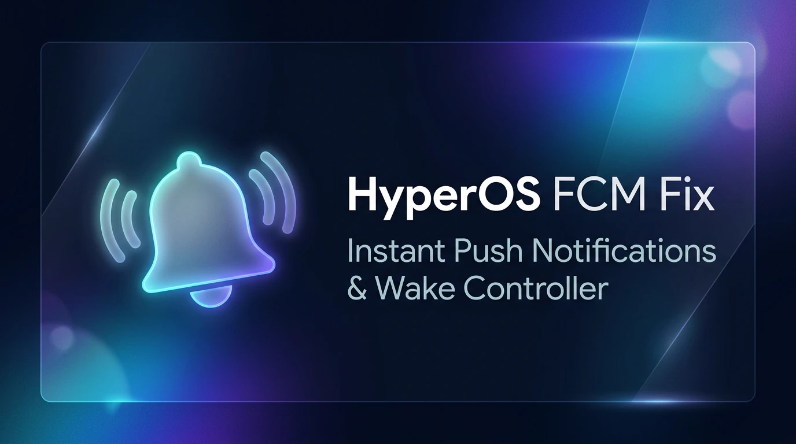

# HyperOS FCM & GMS Push Notification Fix (On-Device Patcher)

<p align="center">
  
</p>

[](https://github.com/biplobsd/fcm_notification_fix/actions/workflows/build-release.yml)
[-orange.svg)](https://www.mi.com/hyperos)
[](https://developer.android.com)
[](https://kernelsu.org)
[]()
[](LICENSE)

A **zero-PC, dynamic on-device surgical bytecode patcher** and **KernelSU WebUI controller** for Xiaomi HyperOS China ROMs that permanently resolves Google Play Services (GMS) and Firebase Cloud Messaging (FCM) push notification delays, missed messages, and app wake-up issues.

---

## ⚡ Features & Highlights

- 🚀 **Zero-PC On-Device Patching**: Patches live `services.jar` and `miui-services.jar` on the fly via Dalvik/ART runtime—100% compatible with any HyperOS version and OTA updates.
- 🛡️ **Safe & Bootloop-Proof**: Transactional all-or-nothing patch engine with guaranteed 4-byte DEX alignment.
- 🔋 **Zero Battery Drain & 0 Daemons**: Retains kernel cgroup freezer (`greezer`) for inactive apps; no background daemons running.
- 🎛️ **KernelSU / APatch / Magisk WebUI**:
  - **Dynamic Modes**: Switch between `Allow All`, `Whitelist`, and `Blacklist` without rebooting.
  - **Sound Anti-Mute**: Fixes grouped notification alerts (`GROUP_ALERT_FIX`) and unthrottles vibration (`UNTHROTTLE_VIB`).
  - **Smart Management**: 1-tap recommended apps preset, real-time app status (`ACTIVE` / `STOPPED`), 5-way filter tabs, and preset import/export.
  - **Out-of-the-Box Visibility**: Automates Lock Screen, Floating/Banner, Badge, Vibration, and Screen Wakeup settings for all installed apps.

---

## 💡 Recommendation: Use Whitelist Mode

By default, the module runs in **`Allow All`** mode. However, some shopping and social apps abuse **silent/raw data pushes** (invisible payloads without notifications) to wake up in the background and drain battery.

**Recommended Setup**:
1. Open the module's **WebUI** in KernelSU / APatch / Magisk.
2. Switch mode to **`Whitelist`** $\rightarrow$ tap **Recommended Preset** (Chat, Banking, Email, 2FA).
3. Non-whitelisted apps remain frozen by HyperOS (`greezer`), preserving maximum battery life.

---

## 📢 App Notification Channels & Silent Screen Wakeup

### Why Messages Sometimes Light Up the Screen Silently
Many modern messaging and social apps (e.g. Telegram, WhatsApp, Discord, Slack) dynamically create notification channels per category, chat, and topic:
- When apps group or bundle multiple unread messages, child notifications or summary rows are frequently routed to **secondary, silent, or internal channels** configured with `sound=null` and `vibrate=false`.
- **The screen lights up without sound or vibration** because HyperOS wakes the display on all incoming notification events, while Android suppresses sound and vibration for channels configured as silent.

### How to Ensure Sound & Vibration for Any App
1. Open **Android Settings** $\rightarrow$ **Notifications & status bar** $\rightarrow$ **App notifications** $\rightarrow$ select the app (e.g. *Telegram*, *WhatsApp*, etc.).
2. Tap **Notification categories**.
3. Check all relevant categories (e.g. *Internal notifications*, *Silent*, *Group notifications*, *Messages*) $\rightarrow$ turn **Allow sound** and **Allow vibration** **ON**.
4. In the app's in-app notification settings $\rightarrow$ ensure individual chats, groups, or topics are not muted.

---

## 📦 Installation

### Requirements
- Xiaomi / Redmi device running **HyperOS 3+** (CN) / **Android 16+**
- Rooted with **KernelSU**, **APatch**, or **Magisk**

### Steps
1. Download `HyperOS_FCM_OnTheFly_Fix-v*.zip` from [Releases](https://github.com/biplobsd/fcm_notification_fix/releases).
2. Flash the module in **KernelSU / APatch / Magisk**.
3. Reboot your device.

---

## 🚨 Bootloop Protection & Emergency Safe Mode

- **Hardware Volume Key**: Force restart $\rightarrow$ hold **Volume Down (-)** until lock screen to enter Safe Mode (disables all modules).
- **Custom Recovery (TWRP / OrangeFox)**: Run `touch /data/adb/modules/fcm_notification_fix/disable` in Recovery Terminal.

---

## 🏗️ Building from Source

```bash
git clone https://github.com/biplobsd/fcm_notification_fix.git
cd fcm_notification_fix
chmod +x build.sh && ./build.sh
```

---

## 📄 License

This project is licensed under the [MIT License](LICENSE).
