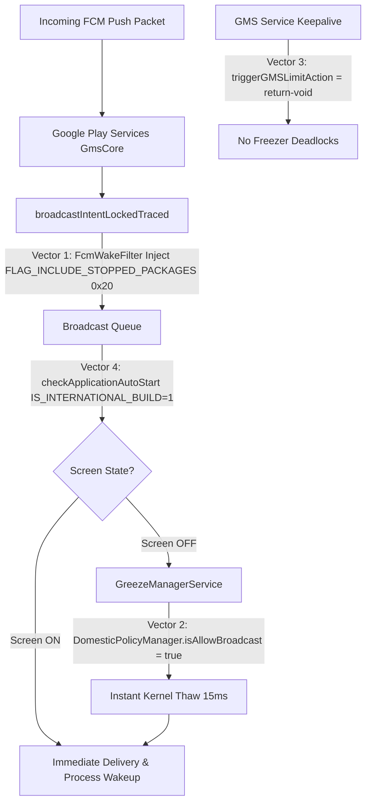

# HyperOS FCM & GMS Push Notification Fix (On-Device Patcher)

<p align="center">
  
</p>

[](https://github.com/biplobsd/fcm_notification_fix/actions/workflows/build-release.yml)
[-orange.svg)](https://www.mi.com/hyperos)
[](https://developer.android.com)
[](https://kernelsu.org)
[]()
[](LICENSE)

A **zero-PC, dynamic on-device surgical bytecode patcher** and **KernelSU WebUI controller** for Xiaomi HyperOS and MIUI China ROMs that permanently resolves Google Play Services (GMS) and Firebase Cloud Messaging (FCM) push notification delays, missed messages, and app wake-up issues.

---

## ⚡ Key Highlights

- 🚀 **Zero-PC On-Device Patching**: Patches your device's live `/system/framework/services.jar` and `/system_ext/framework/miui-services.jar` on the fly during module flashing using Dalvik/ART runtime.
- 🎛️ **KernelSU / APatch / Magisk WebUI**: Full-featured, lightweight mobile WebUI to configure wake modes and filter apps in real-time.
- 🎯 **100% ROM & Update Compatible**: Automatically adapts to any HyperOS/MIUI version or monthly OTA update without hardcoded binary replacements.
- 🛡️ **Transactional All-or-Nothing Engine**: If any patch vector fails verification during installation, the installer aborts cleanly leaving the stock system 100% untouched.
- 📐 **Guaranteed 4-Byte DEX Alignment**: Uses custom byte-level ZIP repacking to ensure all `.dex` entries satisfy ART `mmap()` 4-byte boundaries, eliminating bootloops and SIGBUS faults.
- 🔋 **Zero Battery Drain & 0 Daemons**: Retains Xiaomi's kernel cgroup freezer (`greezer`) for inactive apps while allowing push thaws. Post-boot service scripts exit cleanly after configuration.
- 🔔 **Out-of-the-Box Visibility**: Automates Lock Screen, Floating/Banner, Badge, Vibration, and Screen Wakeup settings for all installed apps.

---

## 📱 Interactive KernelSU WebUI Controller

The module includes an ultra-fast, zero-overhead WebUI built right into the KernelSU / APatch module card.

### WebUI Features
- **Dynamic 3-Way Mode Controller** (Instantly applies without rebooting):
  - **`Allow All`**: Injects `0x20` into all C2DM broadcasts. Every stopped app wakes on incoming push.
  - **`Whitelist`**: Only user-selected apps receive wake flags (e.g. WhatsApp, Telegram, Banking). Inactive apps (games, shopping) stay strictly stopped.
  - **`Blacklist`**: Block specified noisy apps from waking up while allowing all others.
- **⭐ 1-Tap Recommended Preset**:
  - Automatically identifies and checks all critical apps (**Banking, Financial Wallets, Real-time Chat/Messaging, Email, and 2FA Authenticators**) with a single tap.
- **Live Android App State Tracking**:
  - Real-time badges indicate whether each package is currently **`ACTIVE`** (running in RAM) or **`STOPPED`** (`stopped=true` in `dumpsys package`).
- **5-Way Filter Tabs**:
  - Filter view instantly by `All`, `Enabled`, `Disabled`, `Active`, or `Stopped` with real-time package counters.
- **1-Tap Clipboard Copy**:
  - Tap on any package name to instantly copy it to your clipboard (`📋`) for easy searching.
- **Preset Import / Export**:
  - Export your selected whitelist to clipboard or import package lists with support for newlines and commas.

---

## 🔍 Root Cause Analysis (Why FCM Fails on HyperOS CN)

On HyperOS China ROMs, Google FCM push notifications fail due to four architectural bottlenecks:

| Vector | Stock Failure Mechanism | Consequence |
| :--- | :--- | :--- |
| **Vector 1** | Android's `PackageManagerInternal` drops broadcasts to apps in `stopped=true` state unless `FLAG_INCLUDE_STOPPED_PACKAGES` (`0x20`) is present. | Inactive/swiped-away apps never wake up when an FCM push arrives. |
| **Vector 2** | `DomesticPolicyManager.isAllowBroadcast()` returns `false` on CN models during Screen-OFF. | `GreezeManagerService` drops incoming C2DM broadcasts to frozen apps while the screen is locked (`reason: Greezer Denial`). |
| **Vector 3** | `GreezeManagerService.triggerGMSLimitAction()` aggressively quick-freezes `com.google.android.gms.persistent`. | Play Store, Chrome, and GMS-dependent apps hang on cold start due to frozen Binder IPC providers (`futex_wait_queue`). |
| **Vector 4** | `BroadcastQueueModernStubImpl.checkApplicationAutoStart()` restricts background intent delivery on China builds (`IS_INTERNATIONAL_BUILD = false`). | Incoming push intents are blocked by MIUI's background autostart manager. |

---

## 🛠️ How This Fix Solves It (Surgical Bytecode Vectors)

This module applies 4 targeted Smali/DEX bytecode modifications directly into framework JARs:



### 1. `services.jar` (`BroadcastController` + `FcmWakeFilter`)
- **Target**: `Lcom/android/server/am/BroadcastController;->broadcastIntentLockedTraced`
- **Fix**: Injects custom `FcmWakeFilter.filterFlags()` to dynamically evaluate `/data/system/fcm_wake.conf` and append `0x20` (`FLAG_INCLUDE_STOPPED_PACKAGES`) per package rules.

### 2. `miui-services.jar` (`DomesticPolicyManager`)
- **Target**: `Lcom/miui/server/greeze/DomesticPolicyManager;->isAllowBroadcast`
- **Fix**: Rewritten to return `true`, matching Global/EEA ROM behavior where frozen apps are thawed on push broadcasts even with the screen locked.

### 3. `miui-services.jar` (`GreezeManagerService`)
- **Target**: `Lcom/miui/server/greeze/GreezeManagerService;->triggerGMSLimitAction`
- **Fix**: Rewritten to `return-void`. Eliminates aggressive SIGSTOP quick-freezing on `com.google.android.gms`, ensuring persistent FCM socket connectivity (`mtalk.google.com:5228`).

### 4. `miui-services.jar` (`BroadcastQueueModernStubImpl`)
- **Target**: `Lcom/android/server/am/BroadcastQueueModernStubImpl;->checkApplicationAutoStart`
- **Fix**: Replaces `miui.os.Build.IS_INTERNATIONAL_BUILD` check with constant `1` for C2DM intent flows, bypassing restrictive CN autostart filters.

---

## 📊 Live Benchmarks & Verification

Tested on **REDMI K80 (HyperOS 3.0 / Android 16 / SDK 36)**:

| Metric / Test | Stock HyperOS CN | With FCM Fix Module |
| :--- | :---: | :---: |
| **Force-Stopped App Wake Latency** | ❌ Never (Dropped) | ✅ **34 ms** (GitHub) / **60 ms** (WhatsApp) |
| **Screen-OFF Push Delivery** | ❌ Delayed / Suppressed | ✅ **15 ms** Instant Thaw |
| **Play Store / Chrome Cold Start** | ⚠️ Intermittent Freeze | ✅ **Instant** (`mResumed=true`) |
| **FCM Push Socket (`mtalk.google.com`)** | ⚠️ Frequent Disconnects | ✅ **Stable Keepalive** (0 Failed Logins) |
| **Background CPU Overhead** | — | ✅ **0% Overhead** (95.5% CPU Idle) |
| **Background App Freeze Rate** | ~90% | ✅ **~93% Preserved** (WhatsApp/Telegram frozen when idle) |

---

## 📦 Installation

### Requirements
- Xiaomi / Redmi device running **HyperOS 3.0+**
- **Android 16+**
- Rooted with **KernelSU**, **APatch**, or **Magisk**

### Steps
1. Download the latest `HyperOS_FCM_OnTheFly_Fix-v*.zip` from the [Releases](https://github.com/biplobsd/fcm_notification_fix/releases) page.
2. Open **KernelSU / APatch / Magisk Manager**.
3. Navigate to **Modules** $\rightarrow$ **Install from storage**.
4. Select the downloaded `.zip` file and let the on-device engine patch your live framework.
5. Reboot your device.

---

## 🚨 Bootloop Protection & Emergency Safe Mode

Although the on-device patch engine enforces strict bytecode verification and 4-byte DEX alignment before committing any change, you can instantly disable all modules or recover your device using any of the methods below:

### Method 1: Hardware Volume Key (KernelSU / APatch / Magisk Safe Mode)
1. Force restart your device (hold `Power` button).
2. As soon as the device vibrates or the manufacturer boot logo appears, **press and hold the `Volume Down (-)` key** continuously until the system reaches the lock screen.
3. **Result**: KernelSU/APatch enters Safe Mode and **disables all modules**. You can now open KernelSU Manager to manage or remove the module.

### Method 2: Custom Recovery Terminal (TWRP / OrangeFox)
If you have TWRP or OrangeFox installed, navigate to **Advanced** $\rightarrow$ **Terminal** or connect via ADB in recovery:

- **Disable this specific module**:
  ```bash
  touch /data/adb/modules/fcm_notification_fix/disable
  ```
- **Remove this specific module completely**:
  ```bash
  touch /data/adb/modules/fcm_notification_fix/remove
  ```
- **Disable ALL KernelSU modules simultaneously**:
  ```bash
  touch /data/adb/disable
  ```

### Method 3: Emergency ADB Command (Rooted)
If USB debugging is enabled and authorized:
```bash
adb wait-for-device shell "su -c 'touch /data/adb/modules/fcm_notification_fix/disable && reboot'"
```

---

## 🏗️ Building from Source

### Prerequisites
- JDK 17+
- Android SDK (`build-tools` + `platforms`)

### Build Command
```bash
git clone https://github.com/biplobsd/fcm_notification_fix.git
cd fcm_notification_fix
chmod +x build.sh
./build.sh
```

The compiled flashable zip will be generated at `out/HyperOS_FCM_OnTheFly_Fix-<version>.zip` along with its SHA256 checksum in `out/HyperOS_FCM_OnTheFly_Fix-<version>.zip.sha256`.

---

## 🔧 Verification & Diagnostics

To verify on-device health and push state after booting:

```bash
# Check GMS push socket connection
adb shell "dumpsys activity service com.google.android.gms/.gcm.GcmService | grep -E 'connected=|failedLogins='"

# Check Greezer service and frozen states
adb shell "cmd greezer dump"

# Check active system wake locks (should be 0)
adb shell "dumpsys power | grep 'Wake Locks: size='"
```

---

## 🛡️ Safety & Uninstallation

- **100% Systemless**: Never touches physical `/system` or `/system_ext` partitions.
- **Easy Removal**: Disable or uninstall the module in KernelSU/Magisk and reboot. Your system immediately reverts to 100% stock binaries.

---

## 📄 License

This project is licensed under the [MIT License](LICENSE).
